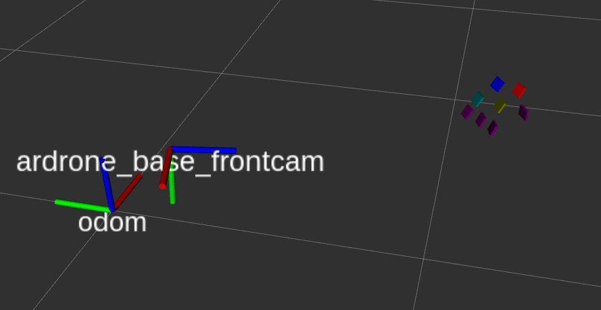

# ardrone_carrier

ROS project fro an ardrone landing on mobile platform.

## TODO

### navigation_node (and pid)

- new behavior : when receiving a new NavigationGoal msg, if quaternion is null, ignore rotation and simply fly to given position.
- bug to fix : convert new NavigationGoal into right frame
- test node on drone

### flight_manager_node

- test node on drone with real navigation


## Ar Track Alvar

### Mode d'emploi

Pour lancer la détection des QR codes avec ar_track_alvar :
1. créer un répertoire "camera_info" dans les fichiers cachés de ROS : `mkdir ~/.ros/camera_info`
2. copier dans ce répertoire les fichiers de calibration des caméras du drone : `cp <ardrone_carrier>/config/ardrone_front.yaml ~/.ros/camera_info/ardrone_front.yaml` et `cp <ardrone_carrier>/config/ardrone_bottom.yaml ~/.ros/camera_info/ardrone_bottom.yaml`
3. lancer le driver du drone : `roslaunch ardrone_carrier ardrone_driver.launch`
4. lancer ar_track_alvar : `roslaunch ardrone_carrier track_alvar_ardrone.launch` ou `roslaunch ardrone_carrier track_alvar_ardrone_bundles.launch`
5. pour visualiser les détections, lancer `rviz` et ajouter les "Marker" correspondant au topic "/visualization_marker"




### Observation des détections individuelles et *tf*

Launchfile à utiliser : `roslaunch ardrone_carrier track_alvar_ardrone.launch`.
Lorsque détectés, les markers sont publiés sous forme de liste dans le topic `/ar_pose_marker`. On peut passer en paramètre "*output_frame*" du noeud ar_track_alvar le frame_id à utiliser comme référence : les positions des markers seront alors dans cette référence. Exemple d'un message repérant les markers 8 et 6, et publiant leur position dans la référence `/ardrone_base_link`
```
header:
  seq: 2685
  stamp:
    secs: 0
    nsecs:         0
  frame_id: ''
markers:
  -
    header:
      seq: 0
      stamp:
        secs: 1542361017
        nsecs: 764956265
      frame_id: "/ardrone_base_link"
    id: 8
    confidence: 0
    pose:
      header:
        seq: 0
        stamp:
          secs: 0
          nsecs:         0
        frame_id: ''
      pose:
        position:
          x: 1.34920739926
          y: 0.357020739996
          z: -0.114796319112
        orientation:
          x: 0.576315838851
          y: -0.243526939676
          z: -0.382980321762
          w: 0.679618096202
  -
    header:
      seq: 0
      stamp:
        secs: 1542361017
        nsecs: 764956265
      frame_id: "/ardrone_base_link"
    id: 6
    confidence: 0
    pose:
      header:
        seq: 0
        stamp:
          secs: 0
          nsecs:         0
        frame_id: ''
      pose:
        position:
          x: 1.30798827365
          y: 0.468062354214
          z: -0.105472469423
        orientation:
          x: 0.444040791619
          y: -0.348176967016
          z: -0.552468994848
          w: 0.613497012829
```

### Observation des détections multiples (*bundles*)

Launchfile à utiliser : `roslaunch ardrone_carrier track_alvar_ardrone_bundles.launch`.
L'idée est de définir un "objet" rigide composé de plusieurs QR codes. On définit dans un fichier XML la position de ces QR codes pa rapport à la position d'un QR code *master*, ou principal. Seront publiés alors sur `/ar_pose_marker` la position du QR code *master* de ce bundle.
La détection multiple permet d'être plus robuste aux occlusions, et de fournir une meilleure estimation de la position de l'objet total.

## Tum Ardrone


### Setting target using the mouse from video feed

Clicking on the video window will generate way points, which are sent to drone_autopilot (if running):

- left-click: fly (x,y,0)m relative to the current position. The image-center is (0,0), borders are 2m respectively.
- right-click: fly (0,0,y)m and rotate yaw by x degree. The Image-center is (0,0), borders are 2m and 90 degree respectively.


## Calibration de la caméra

Voir tutoriel [camera_calibration](http://wiki.ros.org/camera_calibration/Tutorials/MonocularCalibration).

Paramètres:
- `size`: taille en mètres des carrés de la mire
- `cam_topic`: nom du topic où sont publiées les images de la caméra à calibrer
- `cam_name`: nom de la caméra à calibrer

```
size=0.1085
cam_topic=/ardrone/front/image_raw
cam_info_topic=/ardrone/front/camera_info
rosrun camera_calibration cameracalibrator.py --size 8x6 --square $size image:=$cam_topic camera:=$cam_name
```

1. Lancer les commandes ci-dessus
2. Bouger la mire dans le champ de vision de la caméra jusqu'à obtenir les jauges vertes
3. Cliquer sur "Calibrate" UNE SEULE FOIS. Le calcul du modèle de transformation peut prendre jusqu'à 1 min.
4. Cliquer sur "Commit" pour enregistrer la calibration dans `/home/<username>/.ros/camera_info/`, ou sur "Save" pour écrire les résultats dans une archive `/tmp/calibrationdata.tar.gz`
